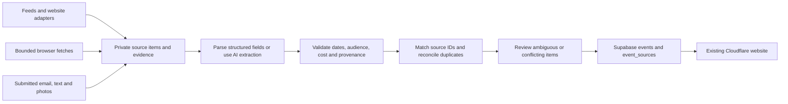

# Campus Radar: event-source feasibility and ingestion deployment

Research date: **September 20, 2026**. Scope: the sources in `Basic idea.md`, the current repository, and a practical prototype deployment. This is a research recommendation; no ingestion service, credentials, subscriptions, or production changes were created.

## Recommendation

**Build a shared ingestion pipeline with several small source adapters. Use public feeds first, website extraction second, and AI for ambiguous text and posters.** There is enough accessible Northwestern event data to launch without depending on Instagram, RedNote, or Eventbrite catalog access.

One PlanIt Purple adapter already covers several university calendars. Bienen supplies another useful structured source. Chicago calendars can add nearby activities. Social posts, newsletter prose, and photographed posters are valuable for coverage, but need different collection methods and stronger review.

A generic pipeline is feasible; a generic agent that reliably obtains everything from every platform is not a sound dependency. An agent can navigate a page or interpret a poster, but cannot create API permissions, recover expired Stories, or guarantee that a calendar is accurate.

**Prototype deployment:** keep the Cloudflare website and Supabase database; run a small TypeScript ingestion job in GitHub Actions on a schedule and manually. Add managed browser execution only for sources that need it. Cloudflare is also a viable ingestion platform, contrary to the blanket restriction in the earlier plan.

## What was verified

“Verified” below means a public response, rendered page, or official documentation was inspected during this research. It does **not** mean a production adapter has passed a week-long reliability test. Observed website endpoints are distinguished from documented APIs. Source fields can be absent, stale, or internally inconsistent even when HTTP returns 200.

Suggested cadences and priorities are design recommendations, not publisher guarantees. P0 means start here; P1 means useful expansion; P2 means conditional or lower priority.

## Northwestern sources

| Source | Availability and fields | Collection recommendation | Priority |
|---|---|---|---|
| **PlanIt Purple** | Working public XML and JSON feeds. Dates, timezone, location, descriptions, registration, cost, image fields, and identifiers are available, though individual fields can be empty. JSON distinguishes occurrence ID from parent event ID. | Deterministic feed parsing. Use a bounded upcoming window and appropriate audience/campus filters. Preserve cancellations and individual occurrences. Refresh every 4–6 hours; official guidance says no more than hourly. | P0 |
| **Bienen** | A working JSON endpoint returned 946 records, including historical events. It includes date offsets, node IDs, pricing, images, and status. Location can be an opaque ID. Raw calendar HTML alone misleadingly shows an empty placeholder. | Parse JSON, filter upcoming/calendar-visible records, enrich location from event details. This is an observed internal website endpoint, not a supported public API contract. Start daily. | P0/P1 |
| **Wirtz** | Its official calendar embeds PlanIt Purple feed 1978. Working JSON supplies performance occurrences and ticket information; sample image fields were empty. | Reuse the PlanIt Purple adapter and merge overlapping records. Add show-page poster enrichment only if needed. | P1, little extra collection work |
| **GroupX** | Public HTML has class, weekday, time, instructor, studio, term dates, and closure notices. PlanIt Purple also lists actual class occurrences. No working event export was verified. | Prefer calendar occurrences; use schedule HTML to validate term boundaries and closures. Do not turn a representative weekly row into an indefinite recurrence. Check daily and at quarter transitions. | P1 |
| **The Garage** | Its website embeds a working public AddEvent calendar, including fall 2026 events, descriptions, location, and dates. Some entries are resident-team-only. Exact ICS subscription URL was not verified. | Parse AddEvent calendar HTML and event links; retain audience restrictions. Convert observed UTC dates for Chicago display. Verify detail-page completeness during implementation. Start daily. | P1 |
| **PawPrint** | The public page contains current event blurbs/images and links to working PlanIt Purple JSON feed 1898. Page selections and feed contents are not identical. No complete public email archive was verified. | Feed first, then extract changed public-page sections for additional items. AI helps with prose, rain dates, and restrictions. No mailbox integration is needed to begin. Daily, with a check after Wednesday evening publication. | P1 |
| **’Cats on Campus** | The CampusGroups home exposes a public shell and an upcoming count, but the inspected events page returned JavaScript placeholders. Northwestern documents NetID login for the full experience. | No complete public event sample or event-data endpoint was verified. Seek an authorized feed/export or organizer cooperation. Do not count this as available inventory yet. | P2, access unresolved |

Evidence and implementation starting points:

- PlanIt Purple: [official feed guidance](https://www.northwestern.edu/web-resources/developer-resources/planitpurple-feeds/), [XML specification](https://www.northwestern.edu/web-resources/developer-resources/planitpurple-feeds/xml-feeds.html), [JSON specification](https://www.northwestern.edu/web-resources/developer-resources/planitpurple-feeds/json-feeds.html), and [working small XML sample](https://planitpurple.northwestern.edu/xmlfeed?cal=0&days=14&audience=2&max=2). Creating saved feeds can require login; the tested public feeds were readable without it. Private feeds have separate access requirements.
- Bienen: [calendar](https://www.music.northwestern.edu/events/calendar), [observed JSON endpoint](https://www.music.northwestern.edu/get_events/event_resource?_format=json), and [sample concert detail](https://www.music.northwestern.edu/events/glorious-musical-jewels-beethoven-and-schubert).
- Wirtz: [official calendar](https://wirtz.northwestern.edu/wirtz-calendar/), [working feed 1978](https://planitpurple.northwestern.edu/feed/json/1978), and [sample event](https://planitpurple.northwestern.edu/event/645116). Direct Wirtz access encountered TLS/transport problems; the feed worked. Production code should not disable certificate verification.
- GroupX: [schedule](https://nurecreation.com/sports/groupx/schedule). On the research date, the displayed schedule ended September 20 and explicitly canceled September 19 classes. This demonstrates why term bounds and exceptions matter.
- Garage: [official events page](https://www.thegarage.northwestern.edu/events), [embedded public calendar](https://www.addevent.com/calendar/Id622001), and [Family Dinner example](https://www.addevent.com/event/sld81x1p0mx5).
- PawPrint: [public page](https://www.northwestern.edu/studentaffairs/news-events/pawprint.html), [working feed 1898](https://planitpurple.northwestern.edu/feed/json/1898), and [publication guidance](https://www.northwestern.edu/studentaffairs/marketing/).
- ’Cats on Campus: [home](https://catsoncampus.northwestern.edu/), [events shell](https://catsoncampus.northwestern.edu/events), and [Northwestern access guidance](https://www.northwestern.edu/studentorgs/students/). A login-oriented shell is not proof that every individual event is private.

## Chicago and Evanston websites

| Source from the idea document | Observed availability | Best approach / limitation |
|---|---|---|
| **Choose Chicago monthly article** | Its separate events calendar exposes Event JSON-LD, pagination, a working JSON events endpoint, and a working ICS export. These are better structured inputs than the monthly roundup. | Start with calendar JSON/ICS, with date bounds and pagination. Use the monthly article later for editorial recommendations or items absent from the calendar. P1. [Article](https://www.choosechicago.com/blog/special-events/things-to-do-in-chicago-this-month/), [calendar](https://www.choosechicago.com/events/). |
| **Downtown Evanston** | The page embeds Vibemap. Rendered calendar data contained 129 Event JSON-LD records, while only 50 cards were initially visible. Images, times, and offers exist, but offer/status data had significant inaccuracies. | Extract the embedded calendar with a controlled browser if necessary, then check organizer details for pricing and cancellations. High geographic relevance; begin with review rather than automatic publication. P1. [Calendar page](https://downtownevanston.org/upcoming-events), [embedded calendar](https://on.vibemap.com/evanston-events). |
| **Do312** | Browser access worked. Events expose HTML microdata with dates/offsets, address, coordinates, and images; pagination exists. It is not necessary for structured data to be JSON-LD. | Deterministic microdata/detail extraction, browser fallback when plain fetching fails. Establish real deployment access and incremental coverage before increasing frequency. P1/P2. [Do312](https://do312.com/). |
| **ChicagoEvents / Special Events Management** | Browser pages expose Event JSON-LD and calendar export links. Tested raw API/export requests returned a client challenge disguised as HTTP 200, rather than usable event data. | Browser-assisted HTML/JSON-LD collection is a candidate. Verify actual response content and reliability; do not label the advertised API/export as a working feed. P2. [Upcoming events](https://chicagoevents.com/upcoming-events/). |
| **The Savvy Globetrotter: this weekend / this week / next weekend** | Accessible editorial articles. Article metadata, WordPress article routes, and RSS can help detect revisions; these are not event feeds. | One bounded article-to-events extraction, retaining section evidence and linked organizer pages. Resolve dates using the article edition, deduplicate across all three overlapping pages, and avoid treating evergreen attractions as one-off events. P2. [Weekend page](https://www.thesavvyglobetrotter.com/things-to-do-this-weekend-chicago/). |
| **Your Chicago Guide calendar** | The inspected browser page showed introductory copy but no working event calendar; metadata reported a 2022 modification date. | Defer. No usable current event inventory was verified. Revisit only when a functioning calendar/feed can be demonstrated. P2. [Listed calendar](https://yourchicagoguide.com/chicago-events-calendar/). |

Verified starting points and useful detail samples:

- Choose Chicago: [tested JSON events query](https://www.choosechicago.com/wp-json/tribe/events/v1/events?start_date=2026-09-20&per_page=2), [working ICS export](https://www.choosechicago.com/events/?ical=1), and [second calendar page](https://www.choosechicago.com/events/page/2/). The JSON response provides pagination metadata and a next-page URL; the tested ICS export contained 30 occurrences, so an export should not be assumed to cover the whole catalog.
- Do312: [inspected event detail](https://do312.com/events/2026/9/19/the-magnificent-mile-art-fest-tickets) and [second listing page](https://do312.com/?page=2). Direct HTTP returned 403 while the ordinary browser worked; deployment access still needs a pilot.
- ChicagoEvents: [Oktoberfest detail](https://chicagoevents.com/event/oktoberfest-chicago/). Its prose supplies daily opening hours and admission conditions, while its main schema represents an all-day festival span and another schema block is malformed. Browser rendering does not remove the need to reconcile fields.
- Savvy Globetrotter: [this week](https://www.thesavvyglobetrotter.com/things-to-do-this-week-chicago/), [next weekend](https://www.thesavvyglobetrotter.com/things-to-do-next-weekend-chicago/), and [article RSS](https://www.thesavvyglobetrotter.com/feed/). All three roundup pages were inspected; article dates and event dates must remain separate.

Two concrete quality failures deserve attention:

1. Vibemap still marked the September 20 **Cars & Coffee** event as scheduled, while the [organizer page](https://downtownevanston.org/cars-coffee) said it was canceled due to weather.
2. The same calendar gave every inspected event an offer price of zero, including **Uncensored: A Library Speakeasy Benefit**, whose description stated a $90 ticket. A numeric zero from this source cannot safely mean “free.”

These observations argue for source-specific validation and organizer precedence, not simply “prefer structured data and trust it.” Browser success also does not establish permission to republish full descriptions or poster images; use factual summaries and source links, and handle image rights separately.

## Eventbrite, social platforms, email, and photos

### Eventbrite

An Eventbrite API key does **not** provide unrestricted nearby-event search. The [location-search documentation](https://www.eventbrite.com/platform/docs/by-location) explicitly says Event Search access ended December 12, 2019. Its [API reference](https://www.eventbrite.com/platform/new/api) supports organization/event integrations for accounts the application can access.

Use participating organizer integrations and submitted ticket links. Investigate [partnership access](https://www.eventbrite.com/platform/docs/what-is-app-marketplace) separately; eligibility and catalog coverage are unverified. Eventbrite’s published [terms](https://www.eventbrite.co/help/en-ca/articles/251210/eventbrite-terms-of-service/) prohibit automated extraction, so public scraping should not be presented as the ordinary fallback. Organizer-owned pages may provide the same event facts through a more suitable route.

### Instagram

Potentially useful, but source-by-source feasibility remains conditional. Meta documents professional-account APIs and Business Discovery for other professional accounts; consumer accounts are excluded from that documented route. Calling-app authorization is required, but it is too broad to say every discovery target must authorize. The Facebook Login and Instagram Login integrations have different capabilities and requirements. See Meta’s official [Facebook Login collection](https://www.postman.com/meta/instagram/folder/9cgqucg/instagram-api-with-facebook-login) and [Instagram Login collection](https://www.postman.com/meta/instagram/folder/6raa77c/instagram-api-with-instagram-login).

Test a small professional-account cohort before planning coverage. A public post visible to a person does not guarantee reliable unattended access. Image posters and carousels require vision extraction; captions alone can omit the date or venue. General third-party Story ingestion was **not verified**. Direct Story documentation requests were rate-limited during research, so current permissions must be established before implementation.

Candidate inventory from the document, retained without inventing profile identities:

| Candidate group | Verification status |
|---|---|
| Student Affairs / `studentaffnu`; MSA / `msaatnu`; Norris / `norriscenter`; CAPS / `northwesterncaps`; `nu_rsl`; `northwestern_loc` | Mappings appear in an official [Northwestern article](https://www.northwestern.edu/studentaffairs/news-events/winter-wellness.html) dated March 2025. Current activity and API eligibility were not individually verified. |
| `dittmargallery` | Linked directly by the official [Dittmar page](https://www.northwestern.edu/norris/arts/dittmar-gallery/), which also offers calendar/newsletter alternatives. Live Instagram retrieval was not verified. |
| `NU_csaw`, `nusailingcenter`, `nuwritingplace`, `sustainnu`, `nunasiapowwow`, `nuarchsociety`, `nu_sesp_tlep`, `lunaspub.nu`, `wirtzcenter`, `nuactiveminds`, `nurecreation` | Supplied candidate handles; not individually verified. Prioritize official linked calendars/websites before adding a social-specific collector. |
| `around_evanston`, `palmhouse619`, `chicago_forfree` | Supplied city-source candidates. Search associated `chicago_forfree` with Instagram, but current profile access and extraction coverage were not established. |

Repost-based discovery can propose new accounts for review. It should not silently expand an unattended crawler to arbitrary accounts. Measure what socials add beyond the campus feeds before committing to their maintenance.

### RedNote / Xiaohongshu

The inspected official [sharing platform](https://agora.xiaohongshu.com/) and [login API](https://openaccount.xiaohongshu.com/docs/api-reference) document publishing/sharing and user authentication, not a verified general API for reading arbitrary notes or searching public profiles. This does not rule out private commercial partnerships.

The exact RedNote profiles for `chicago_forfree` and `inChicago` were not verified. Matching names across platforms are insufficient evidence. Start with user-shared canonical links, text, and screenshots. A browser agent is a possible experiment after actual access is established, not a guaranteed production collection method.

### PawPrint emails, other newsletters, and physical posters

These are strong prototype inputs. Start with pasted text, `.eml`/HTML, and photo uploads; later add a forwarding address. [Resend inbound email](https://resend.com/features/inbound) and [Mailgun inbound processing](https://www.mailgun.com/glossary/inbound-processing/) provide supported message/attachment delivery routes.

Use the **original publication date** to resolve “this Friday,” not the forwarding date. Remove recipient information and personalized links before public display. Vision extraction should propose fields beside the original poster for correction. Unreadable text, missing year, eligibility, and fee conditions stay unresolved rather than being invented. User-submitted photos eliminate the external platform-read dependency, but still require event validation.

## What the shared pipeline should do

Use the cheapest reliable extraction method for each source:

1. Documented JSON/XML/ICS feed.
2. Observed structured endpoint, JSON-LD, or HTML microdata.
3. Small deterministic HTML parser.
4. Browser rendering when content requires JavaScript.
5. Schema-constrained AI extraction for unstructured text; vision for images.
6. Bounded agent navigation only when the earlier methods do not suffice.

An agent should have a source/domain allowlist, page/time budget, and a defined output schema. Page text is untrusted data, never instructions to the ingestion service. AI returns candidate fields and evidence; ordinary application code validates and writes them. The model does not need database credentials or arbitrary SQL access.

Every item needs source identity/URL, occurrence ID where available, source publication/update time when available, fetch time, extracted fields, and evidence. Record the extractor version and a content hash so unchanged articles and posters are not repeatedly sent to a model.

### Quality rules that matter for this product

- **Dates:** preserve offsets and display in `America/Chicago`; handle daylight saving, all-day events, missing years, and overnight end times explicitly. Never turn an unknown time into an asserted midnight start.
- **Audience:** distinguish public, Northwestern-only, registered participants, residents, and members. The Garage’s publicly listed resident-only dinners are a concrete example.
- **Price:** unknown is not free. Preserve student/general prices and registration conditions. Keep contradictory structured fields out of automatic publication.
- **Identity:** update by stable source occurrence ID first. A reschedule should update an event, not create an unrelated duplicate because its title/date key changed.
- **Cross-source duplicates:** use canonical URLs/IDs, then title/date/venue similarity. Retain multiple provenance links and manual corrections. Organizer notices should normally outrank roundups and reposts.
- **Changes:** recheck upcoming events for cancellation, venue, and time updates. A failed or empty fetch must never mass-delete published events. Distinguish a successful empty result from a challenge page or parser failure.
- **Review:** initially send imports to review. Promote individual sources to automatic publishing only after measured performance; retain review for conflicts and incomplete candidates.

## Fit with the existing Supabase schema

Reuse `sources`, `events`, and `event_sources`. The existing source/external-ID uniqueness is useful. The generated title/start/location duplicate key is a final exact-match safeguard, not the identity mechanism or a complete reconciliation policy.

The smallest additions worth making when implementation starts are:

- Private ingestion staging for raw/evidence references, parsed candidates, content hash, state, and errors. This is needed because `events.start_time` is mandatory while legitimate source items can have unknown dates.
- A compact run log with last successful fetch, candidate/insert/update counts, and failures. Current `last_fetched_at` alone cannot distinguish healthy ingestion from repeated unsuccessful attempts.
- Explicit event lifecycle and uncertainty handling where necessary: cancellation is different from the existing moderation status; `is_free = false` alone must not be displayed as proof that admission is paid.

Use a trusted backend write path with appropriate grants and secrets. The browser’s publishable Supabase key is not an ingestion credential. Do not repurpose the verified-user `submit_event()` RPC for a machine importer; it intentionally enforces user-submission and poster rules. Keep raw emails and private attachments out of public tables, repository commits, and public CI logs.

No vector database, general agent framework, separate scheduler service, or per-source microservice is needed for the first version.

## Deployment choices

| Option | Fit | Recommendation |
|---|---|---|
| **GitHub Actions + TypeScript job + Supabase** | Uses the existing repository and stack; supports normal libraries and browser tooling. Standard hosted runners are free for public repositories, subject to product limits. Schedules can be delayed or dropped; public-repository schedules disable after 60 days without activity. | **Start here.** Scheduled and manual run, bounded per-source work, isolated failures, retries/backoff, and visible run summaries. Schedule away from the top of the hour. Do not promise minute-level freshness. |
| **Cloudflare Cron Worker + optional Browser Run** | Keeps operations with the existing provider. Workers can fetch feeds/pages; Browser Run provides managed browsers, crawling, and structured extraction. Paid limits are substantially different from the free tier. | Good alternative when regular managed scheduling or browser assistance is worth paying for. Separate ingestion from user-facing page requests. Add Workflows only when durable multi-step retries are needed. |
| **Cloud Run Jobs + Cloud Scheduler** | Container jobs accommodate larger browser workloads and native OCR dependencies. Adds another cloud, IAM, billing, and deployment setup. | Upgrade if measured runtime/dependency needs justify it. Not necessary just to parse feeds and a handful of pages. |

Platform evidence:

- [GitHub scheduling behavior](https://docs.github.com/en/actions/reference/workflows-and-actions/events-that-trigger-workflows) and [Actions billing](https://docs.github.com/en/billing/concepts/product-billing/github-actions). Do not rely on empty “keepalive” commits as an operational solution; monitor freshness and move scheduling if inactivity becomes an issue.
- [Cloudflare Workers limits](https://developers.cloudflare.com/workers/platform/limits/): free accounts have 50 external subrequests per invocation; paid Workers default to 10,000. Thus “Workers can never scrape because of the 50-request limit” is incorrect. CPU, memory, and invocation limits still need to fit the job.
- [Browser Run](https://developers.cloudflare.com/browser-run/), its [crawl endpoint](https://developers.cloudflare.com/browser-run/quick-actions/crawl-endpoint/), and [structured JSON extraction](https://developers.cloudflare.com/browser-run/quick-actions/json-endpoint/). These are useful managed alternatives, **not tested source-specific solutions in this assessment**. Bound crawling tightly; its [published behavior](https://developers.cloudflare.com/changelog/post/2026-03-10-br-crawl-endpoint/) respects robots controls rather than bypassing access gates.
- [Cloudflare Workflows](https://developers.cloudflare.com/workflows/) and [scheduled Cloud Run Jobs](https://docs.cloud.google.com/run/docs/execute/jobs-on-schedule) are later operational options, not launch prerequisites.

### Cost and maintenance

Feed parsing should be inexpensive at prototype volume. A public-repository Actions job may incur no standard-runner charge; Supabase usage, storage, model calls, and browser services are separate. Cloudflare Workers Paid starts at $5/month; browser usage and AI can add charges. Verify selected plans when provisioning rather than assuming the entire pipeline is free. See [Workers pricing](https://developers.cloudflare.com/workers/platform/pricing/) and [Browser Run pricing](https://developers.cloudflare.com/browser-run/pricing/).

Estimate model cost from **changed documents**, not all historical events. For example, 1,000 changed text documents at 3,000 input and 500 output tokens each means 3 million input and 0.5 million output tokens, priced at the selected model’s rates; images add separate usage. This is an illustration, not a forecast. Measure actual inputs in the pilot.

The biggest likely maintenance costs are social access failures, source redesigns, duplicate reconciliation, and reviewing uncertain dates/prices—not basic server hosting.

## Recommended pilot

1. **Establish the dependable campus base:** PlanIt Purple plus Bienen. Include Wirtz and PawPrint through their feeds, measuring overlap instead of building redundant scrapers. Dry-run to staging before writing published events.
2. **Check marginal coverage:** Garage and GroupX, focusing on eligibility, recurrence boundaries, and cancellations. Add a simple curator intake for pasted text and posters; a new dashboard is optional initially.
3. **Add local breadth:** Choose Chicago and Downtown Evanston. Keep sources with observed inaccurate offer/status fields in review. Add Do312 only after its collection access and unique yield are measured.
4. **Run a one-week social experiment:** five representative university accounts and two city accounts with confirmed profile URLs. Track access success, unique useful events, overlap, correction time, and missed posts separately. Do not let social experiments block the launch.
5. **Defer unresolved integrations:** Eventbrite broad catalog access, full ’Cats on Campus access, and RedNote unattended collection until an actual access path is established. Revisit Your Chicago Guide only if a working calendar appears.

Before enabling automatic publication, manually label at least 50 varied candidates across the selected sources and exercise duplicate, changed-time, cancellation, unknown-price, and term-boundary cases. A reasonable proposed gate is at least 98% correct date/time/location on complete records, with every ambiguous field routed to review; this is a target, **not a result achieved by this research**. Separately measure collection coverage and freshness—high extraction accuracy cannot compensate for missing half the source events.

## Corrections to the earlier planning assumptions

This assessment supersedes the source-access and ingestion-hosting assumptions in `PLANNING.md`:

- Eventbrite’s API existence does not establish public discovery access.
- Most Northwestern sources should begin with feeds rather than bespoke scraping.
- Chicago event calendars offer more automation opportunities than weekly manual curation alone.
- Social automation is conditional; neither “all accounts can be scraped” nor “no professional-account API exists” is accurate.
- Cloudflare ingestion is viable within the selected plan’s limits; GitHub Actions remains a simple starting choice, not the only valid host.

The next concrete implementation should be **one bounded ingestion job, two adapters (PlanIt Purple and Bienen), private staging, and a reviewable dry-run report**. Broader collection can follow evidence of useful coverage.
